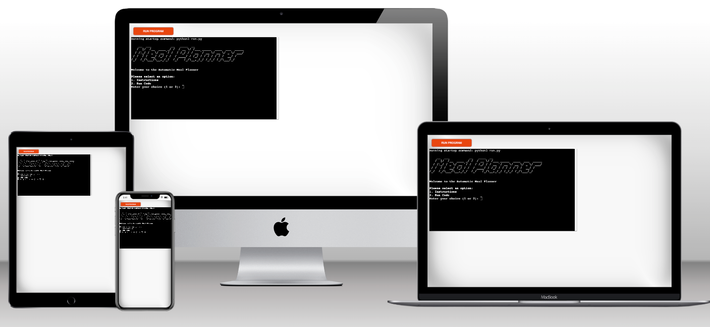
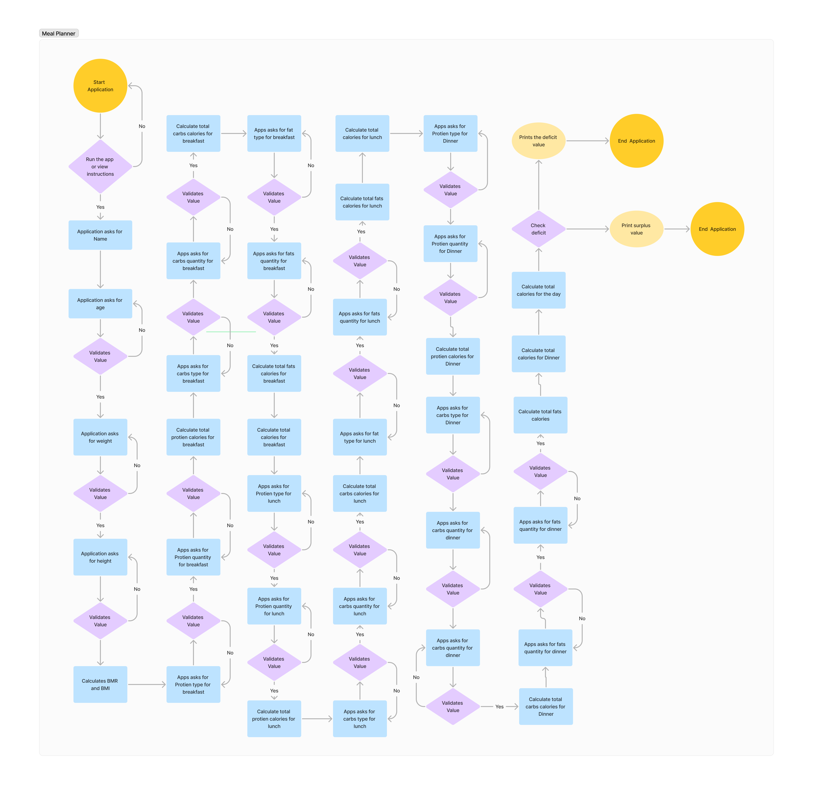
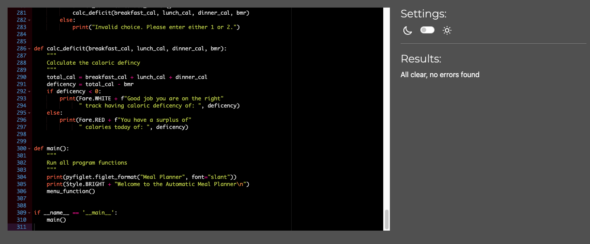

# Meal Planner - Portfolio Project 3

Welcome to Meal Planner, a personalized Python application designed to support and enhance your fitness journey. This innovative application is a dedicated tool to help individuals track, analyze, and plan their daily dietary requirements.

Meal Planner offers a straightforward way to calculate your daily caloric intake. By providing key details about your meals - such as type, portion size, and ingredients - the application can quickly determine your total caloric consumption for the day. The robust algorithm in place has been developed to take into account a wide range of foods, making this feature beneficial for users with diverse dietary preferences.

More than just tallying up your daily calories, Meal Planner also computes your Basal Metabolic Rate (BMR) - the number of calories your body needs to perform essential functions like breathing and maintaining body temperature while at rest. This is calculated using your age, weight, and height.

The magic of Meal Planner doesn't stop there. It goes a step further and determines whether you're in a caloric surplus or not. If you've consumed more calories than your BMR, you're in a caloric surplus - useful for those looking to gain weight or muscle. Conversely, consuming fewer calories than your BMR puts you in a caloric deficit - helpful for those aiming for weight loss.

# Design:
## User Stories
- As a user I should be able to enter my name, age, weight and height
- As a user, I want to input my age, gender, weight, and height so that the app can accurately calculate my Basal Metabolic Rate (BMR).
- As a user, I want to input my age, gender, weight, and height so that the app can accurately calculate my Basal Metabolic Index (BMI).
- As a user, I want to be able to enter my daily meals, along with their ingredients and portion sizes, so that the app can accurately calculate my daily caloric intake.
- As a user, I want to see a clear visualization of my caloric intake compared to my BMR so I can easily understand if I'm in a caloric surplus or deficit.

## Flow Chart:
    

# Features:
* Main menu:
The application has a main menu, The main menu consists of 3 options. Option1 to read the instructions, Option2 to start the app, and Option3 to exit the app.
* Instruction:
Once you run the application you have the option to read the instruction first on how this app works.
* Input validations and error detection:
If a user enter any data the app will check if this data is valid and if its not valid it will prompt the user to enter a valid data. Data validation happens on the weight, age, height, Food list and quantity.
* Colorama:
Since its a terminal app, I used colorama to add a bit of colour where I felt was needed within the terminal to make certain parts stand out to the user. For example adding not valid data a prompt appear with color red.
* Fetching information from Google sheet:
The list of foods and it's caloric data is maintained inside a Google spreadsheet.
* pyfiglet:
pyfiglet takes ASCII text and renders it in ASCII art fonts

## Features Left to Implement
* Create a user profile and store it in a database
* Use database for food and caloric information

# Technologies:
* [Python](https://en.wikipedia.org/wiki/Python_(programming_language)): The program was written entirely in Python.
* [Google Sheets](https://www.google.com/sheets/about/): Google sheets is used to fetch information about food and calories.
* [Google Cloud](https://console.cloud.google.com/): Google cloud was used to enable the APIs needed for this project.
* [Github](https://github.com/): Github was used to store the project's code after being pushed from Git.
* [Gitpod](https://gitpod.io/): Gitpod terminal was used to commit my code using Git and push it to Github.
* [Techsini](http://techsini.com/multi-mockup/index.php): Techsini was used to generate mockups for the project.

# Testing:

## CI Python Linter validation

## Testing Scenarios
| Test Case | Description  | Steps    | Excpected Results | Actual Results | Pass/Fail |
|-----------|--------------|----------|-------------------|----------------|-----------|
| TC001     | Getting instructions from menu   | Run the program then choose option 1  | Instruction will appear and return back to main program | Instruction appeared and returned back to main program | Pass |
| TC002     | Running the app from menu | Run the program then choose option 2 | Application will start | Application started | Pass |
| TC003     | Validating age from user | Run the app then enter your name and age with non-numeric characters  | Error message will appear indicating that it's not a numeric value | Error message appeared | Pass |
| TC004     | Validating weight from user | Run the app then enter your weight with non-numeric characters  | Error message will appear indicating that it's not a numeric value | Error message appeared | Pass |
| TC005     | Validating height from user | Once the app prompts you to enter the height with non-numeric characters  |  Error message will appear indicating that it's not a numeric value | Error message appeared | Pass |
| TC006     | If non numeric data is entered the app will continue prompting to enter the correct value | When the app prompts you to enter your age enter a non numeric character | The app will prompt you to enter the needed value | App will continue prompting you until you enter the needed value | Pass | 
| TC007     | Validating protien type in breakfast | When the app asks you to enter the protien type you had on breakfast. Enter a random characters | An error appear mentioning the entered value is not on the list | Error message appeared | Pass | 
| TC008     | Validating carbs type in breakfast | When the app asks you to enter the carbs type you had on breakfast. Enter a random characters | An error appear mentioning the entered value is not on the list | Error message appeared | Pass | 
| TC009     | Validating fats type in breakfast | When the app asks you to enter the fats type you had on breakfast. Enter a random characters | An error appear mentioning the entered value is not on the list | Error message appeared | Pass | 
| TC010     | Validating protien type in breakfast | When the app asks you to enter the protien type you had on breakfast. Enter "Eggs" | No error will appear and it will continue calculating the calories | No errors and caloris are calculated | Pass | 
| TC011     | Validating carbs type in breakfast | When the app asks you to enter the carbs type you had on breakfast. Enter a "Bread"  | No error will appear and it will continue calculating the calories | No errors and caloris are calculated | Pass | 
| TC012     | Validating fats type in breakfast | When the app asks you to enter the fats type you had on breakfast. Enter a "Olive Oil"  | No error will appear and it will continue calculating the calories | No errors and caloris are calculated | Pass | 
| TC013     | Validating protien type in lunch | When the app asks you to enter the protien type you had on breakfast. Enter a random characters | An error appear mentioning the entered value is not on the list | Error message appeared | Pass | 
| TC014     | Validating carbs type in lunch | When the app asks you to enter the carbs type you had on breakfast. Enter a random characters | An error appear mentioning the entered value is not on the list | Error message appeared | Pass | 
| TC015     | Validating fats type in lunch | When the app asks you to enter the fats type you had on breakfast. Enter a random characters | An error appear mentioning the entered value is not on the list | Error message appeared | Pass | 
| TC016     | Validating protien type in lunch | When the app asks you to enter the protien type you had on breakfast. Enter "Eggs" | No error will appear and it will continue calculating the calories | No errors and caloris are calculated | Pass | 
| TC017     | Validating carbs type in lunch | When the app asks you to enter the carbs type you had on breakfast. Enter a "Bread"  | No error will appear and it will continue calculating the calories | No errors and caloris are calculated | Pass | 
| TC018     | Validating fats type in lunch | When the app asks you to enter the fats type you had on breakfast. Enter a "Olive Oil"  | No error will appear and it will continue calculating the calories | No errors and caloris are calculated | Pass | 
| TC019     | Validating protien type in dinner | When the app asks you to enter the protien type you had on breakfast. Enter a random characters | An error appear mentioning the entered value is not on the list | Error message appeared | Pass | 
| TC020     | Validating carbs type in dinner | When the app asks you to enter the carbs type you had on breakfast. Enter a random characters | An error appear mentioning the entered value is not on the list | Error message appeared | Pass | 
| TC021     | Validating fats type in dinner | When the app asks you to enter the fats type you had on breakfast. Enter a random characters | An error appear mentioning the entered value is not on the list | Error message appeared | Pass | 
| TC022     | Validating protien type in dinner | When the app asks you to enter the protien type you had on breakfast. Enter "Eggs" | No error will appear and it will continue calculating the calories | No errors and caloris are calculated | Pass | 
| TC023     | Validating carbs type in dinner | When the app asks you to enter the carbs type you had on breakfast. Enter a "Bread"  | No error will appear and it will continue calculating the calories | No errors and caloris are calculated | Pass | 
| TC024     | Validating fats type in dinner | When the app asks you to enter the fats type you had on breakfast. Enter a "Olive Oil"  | No error will appear and it will continue calculating the calories | No errors and caloris are calculated | Pass | 
| TC025     | Validating if the quantity entered is a numeric value | When the app asks you about the quantity. Enter a non-numeric value | Error will appear mentioning that you need to enter a numeric value | Error message appeared | Pass | 

# Deployment:
Code Institute has provided a [template](https://github.com/Code-Institute-Org/python-essentials-template) to display the terminal view of this backend application in a modern web browser. This is to improve the accessibility of the project to others.

The live deployed application can be found at [Meal Planner](https://meal-planner-project3-d80578507293.herokuapp.com/).

### Local Deployment

*Gitpod* IDE was used to write the code for this project.

To make a local copy of this repository, you can clone the project by typing the follow into your IDE terminal:
- `git clone https://github.com/moabdelbasset/meal_planner.git`

Alternatively, if using Gitpod, you can click below to create your own workspace using this repository.

### Heroku Deployment

This project uses [Heroku](https://www.heroku.com), a platform as a service (PaaS) that enables developers to build, run, and operate applications entirely in the cloud.

Deployment steps are as follows, after account setup:

- Select *New* in the top-right corner of your Heroku Dashboard, and select *Create new app* from the dropdown menu.
- Your app name must be unique, and then choose a region closest to you (EU or USA), and finally, select *Create App*.
- From the new app *Settings*, click *Reveal Config Vars*, and set the value of KEY to `CREDS`, and the value to of your credentials provided from Google cloud, then select *add*.
- Further down, to support dependencies, select *Add Buildpack*.
- The order of the buildpacks is important, select `Python` first, then `Node.js` second. (if they are not in this order, you can drag them to rearrange them)

Heroku needs two additional files in order to deploy properly.
- requirements.txt
- Procfile

You can install this project's requirements (where applicable) using: `pip3 install -r requirements.txt`. If you have your own packages that have been installed, then the requirements file needs updated using: `pip3 freeze --local > requirements.txt`

The Procfile can be created with the following command: `echo web: node index.js > Procfile`

For Heroku deployment, follow these steps to connect your GitHub repository to the newly created app:

- In the Terminal/CLI, connect to Heroku using this command: `heroku login -i`
- Set the remote for Heroku: `heroku git:remote -a <app_name>` (replace app_name with your app, without the angle-brackets)
- After performing the standard Git `add`, `commit`, and `push` to GitHub, you can now type: `git push heroku main`

The frontend terminal should now be connected and deployed to Heroku.

# Credits
* [pyfiglet](https://www.geeksforgeeks.org/python-ascii-art-using-pyfiglet-module/)
* [colorama](https://pypi.org/project/colorama/)
* [Code Institute Walkthrough Project 3](https://learn.codeinstitute.net/courses/course-v1:CodeInstitute+PE_PAGPPF+2021_Q2/courseware/b3378fc1159e43e3b70916fdefdfae51/605f34e006594dc4ae19f5e60ec75e2e/)